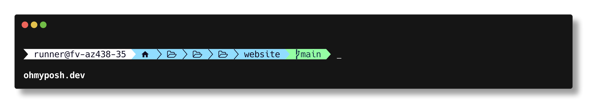

# OhMyPosh: Meilleur Terminal
Avoir un meilleur terminal qui est plus lisible/plus beau.





## Installation

### Installer Window-Terminal
Installer l'application windows-terminal depuis le microsoft store: https://apps.microsoft.com/store/detail/windows-terminal/9N0DX20HK701

### Installer une nerd font 🤓
- Installer  [Meslo LGM NF](https://github.com/ryanoasis/nerd-fonts/releases/download/v2.1.0/Meslo.zip)
ou une de votre choix sur https://www.nerdfonts.com/ 
> Si plusieurs fichier son disponnible dans le dossier de la font, selectionner une qui ne mentione pas bold ou italic
- Dite a Terminal d'utiliser la font de votre choix:
    - Ouvrir les paramètre (la flêche a coté du +)
    - Windows PowerShell -> Apparence -> Type de police

### Installer Oh My Posh
Copier dans le terminal:
```
winget install JanDeDobbeleer.OhMyPosh -s winget
```

### Configuer Oh My Posh
Toujours dans le terminal:
```
notepad $PROFILE
```

> Si la commande donne une erreur, executer cette commande et puis re-essayer: `New-Item -Path $PROFILE -Type File -Force`

Une fenetre Bloc Note devrait s'être ouverte. Ajouter la commande suivante au début du fichier.

```
oh-my-posh init pwsh --config "$env:POSH_THEMES_PATH/my_theme.omp.json" | Invoke-Expression
```
> Noublier pas de sauvegarder le fichier!

Recharger le profil:

```
. $PROFILE
```

### Customizer Oh My Posh

```
Get-PoshThemes
```

Vous pouvez voir quel theme vous preferez sur le site [web](https://ohmyposh.dev/docs/themes)

Pour appliquer le theme voulu:

```
notepad $env:POSH_THEMES_PATH/my_theme.omp.json
```

Copier le code du theme depuis le site web (example: https://github.com/JanDeDobbeleer/oh-my-posh/blob/main/themes/capr4n.omp.json) et coller le dans le bloc note.
> Noublier pas de sauvegarder le fichier!

Appliquer le theme
```
. $PROFILE
```
Enfin, relancer l'application terminal


## Optionnel

- [LSDeluxe](./LSDeluxe.md): Pour une meilleur commande `ls` 
- [Bat](./bat.md): Une commande similaire a cat sur linux qui permet de visioner un fichier via le terminal (voir [image](../assets/bat_example.png))
