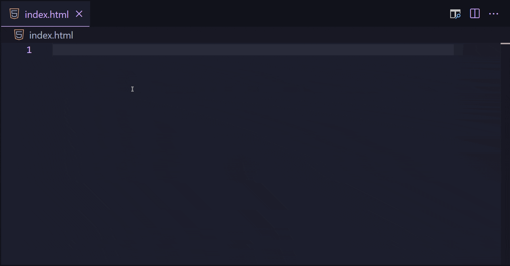
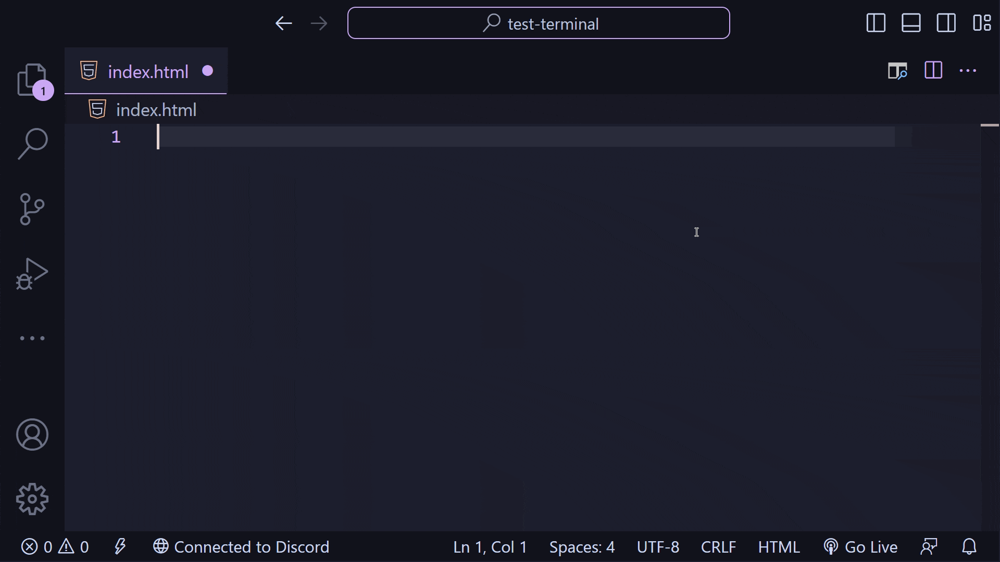
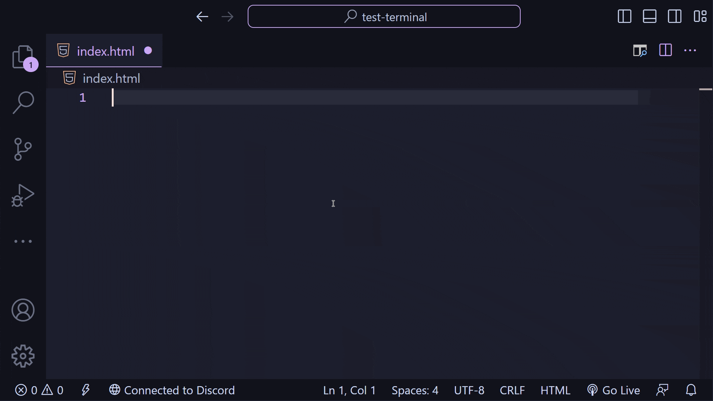

# Abréviations Emmet

Les abrébiations emmet permettent d'écrire du code html plus rapidement et plus simplement.


## Les emmets simples



Écriver les premieres lettres de l'element html que vous vouler et appuyer sur `tab` pour activer l'auto-completion.

```html
div

==>

<div></div>
```

```html
h1

==>

<h1></h1>
```


## Les emmets un peu complexe



### Multiplication (*)

Ajouter `*n`, où `n` est un nombre, a la fin du tag pour l'écrire plusieurs foix:

```html
div*3

==>

<div></div>
<div></div>
<div></div>
```

### Class (.)

Ajouter `.class`, où `class` est une classe css, a la fin du tag pour l'ajouter au tag:


```html
div.content

==>

<div class="content"></div>
```

### Identifiant (#)

Ajouter `#id`, où `id` est un identifiant pour css, a la fin du tag pour l'ajouter au tag:


```html
h1#title

==>

<h1 id="title"></h1>
```

### Texte ({})

Ajouter `{txt}`, où `txt` est du texte, a la fin du tag pour l'ajouter dans le tag:

```html
h1{bonjour tout le monde!}

==>

<h1>bonjour tout le monde!</h1>
```

### Combinner les different modificateur


```html
h1.content#salutation{bonjour tout le monde!}

==>

<h1 id="salutation" class="content">
    bonjour tout le monde!
</h1>
```

## Les emmets complexe




### Child (>)

Ajouter `>element`, où `element` est un element html (div, p, h1), a la fin du tag pour l'ajouter comme enfant:

```html

div>h1

==>

<div>
    <h1></h1>
</div>

```

### Lorem (lorem)

A utiliser comme remplacement pour un texte temporaire:

```html
p>lorem

==>

<p>Lorem ipsum dolor sit amet consectetur adipisicing elit. Culpa excepturi quae, alias itaque corporis maiores inventore perferendis magnam, numquam laudantium libero eaque expedita veritatis sunt, quasi sit qui dignissimos natus.</p>
```
> ! Bien que se soit du texte, lorem est considerer comme un element; p{lorem} donnera `<p>lorem</p>` et non le resultat voulu 

### Brother (+)


Ajouter `+element`, où `element` est un element html (div, p, h1), a la fin du tag pour l'ajouter comme frère:

```html

div>h1+p

==>

<div>
    <h1></h1>
    <p></p>
</div>

```

### Groupe ( **( )** )

Permet de grouper certain elements. Specialement en cas de multiplication

```html

(div>h1+p)*2

==>

<div>
    <h1>
    <p></p>
</div>
<div>
    <h1>
    <p></p>
</div>
```

```html

ul>(li>h1+p)*3

==>

<ul>
    <li>
        <h1>
        <p></p>
    </li>
    <li>
        <h1>
        <p></p>
    </li>
    <li>
        <h1>
        <p></p>
    </li>
</ul>

```

### Sans les parentheses

```html
div>h1+p*2

==>

<div>
    <h1>
    <p></p>
    <p></p>
</div>
```

```html

ul>li>h1+p*3

==>

<ul>
    <li>
        <h1>
        <p></p>
        <p></p>
        <p></p>
    </li>
</ul>

```

### Combinner les different modificateur


```html
div>h1#title{Mon Titre}+p>lorem

==>

<div>
    <h1 id="title">Mon Titre</h1>
    <p>Lorem, ipsum dolor sit amet consectetur adipisicing elit. Quidem voluptates assumenda quam dolores illum facilis eius dolor veritatis vero iusto, unde alias sunt nobis expedita laudantium corporis minus vel dolore.</p>
</div>
```

```html

ul>(li>h1{Titre}+p{mon texte})*3

==>

<ul>
    <li>
        <h1>Titre</h1>
        <p>mon texte</p>
    </li>
    <li>
        <h1>Titre</h1>
        <p>mon texte</p>
    </li>
    <li>
        <h1>Titre</h1>
        <p>mon texte</p>
    </li>
</ul>

```

## Extra

Toutes les abréviations sont dispo sur https://docs.emmet.io/cheat-sheet/